Para añadir nuevos clientes de Facturación electrónica a un servidor que ya contiene otro cliente de facturación electrónica, únicamente deberemos de crear sus DNS y generar sus proxys hosts con certificado SSL con NGINX.

**Para la explicación se ha empleado el mismo ejemplo que el usado para la instalación, pero cada cliente siempre tendrá su propio dominio, que el ejemplo no os confunda.**

## 2. Crear registro A del cliente

Hemos comprado el dominio datacontrolodoo.es, para cada cliente tendremos que crearle varios registros A:

- Servidor

- Portainer

- Webmin

- Nginx

- Duplicatti
1. ¿Cómo elegir el nombre del servidor cliente?
   
   Para elegir el nombre del servidor se tiene que revisar si el cliente tiene dominio propio. Para ello se consultará la ficha de contacto y si el correo electrónico del cliente tiene una extensión de dominio personalizada será ese el nombre del servidor que se usará. Ejemplo, si un cliente tiene de correo electrónico [info.comercial@dwits-prueba.com](mailto:info.comercial@dwits-prueba.com) se deberá de utilizar su nombre de dominio "dwtis-prueba.com" para la creación de su servidor. En cambio, si el cliente no tiene ningún correo electrónico con extensión de dominio personalizada, el programador se deberá de "inventar" el nombre del servidor. Para ello se fijará en el nombre de la empresa y se usará para el nombre del servidor. Ejemplo, si un cliente tiene de correo [info.comercial@gmail.com](mailto:info.comercial@gmail.com) se deberá de "inventar" el nombre del servidor y, para ello, nos fijaremos en el nombre de la empresa que imaginemos que sea Digital Wolf It Solutions, S.L., para este caso un ejemplo de nombre de servidor podría ser DWITS. En cambio, si el nombre de la empresa es Francisco Montes Real pues un nombre de dominio podría ser FMR.
   
   Una vez elegido el nombre del dominio deberemos de acceder al Excel que os facilitaremos para la creación del acrónimo, del nombre del servidor, de las DNS y de los registros A.
   
   Os adjunto un pantallazo usando como ejemplo dwits-prueba:
   
   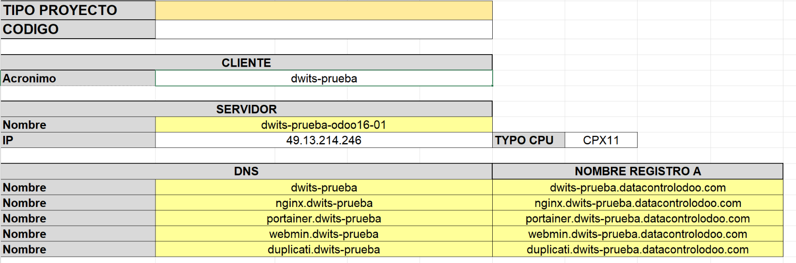
   
   La IP de los registros A será la que te ha creado Hetzner, debe ser la misma en cada uno de los registros creados para que apunten al servidor correcto.

2. Cómo Crear los registros A en DONDOMINIO

Accedemos a la siguiente URL: https://manage.panel247.com/login/

Indicamos el nombre del dominio: datacontrolodoo.com, tu usuario y contraseña

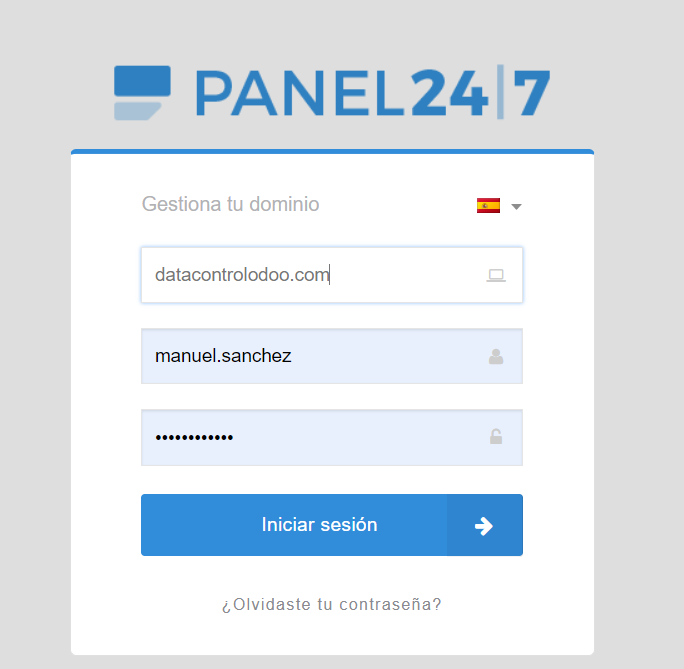

Una vez que accedamos al panel principal, nos dirigiremos a la sección "ALOJAMIENTO" y una vez dentro de esta sección pulsaremos en "Zona DNS".

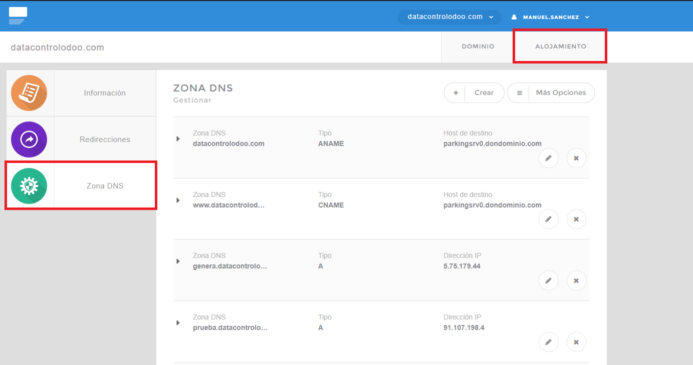

Creamos los registros A que hemos indicado anteriormente. Siguiendo el ejemplo serían los siguientes:

- Servidor: dwits.datacontrolodoo.com
  
  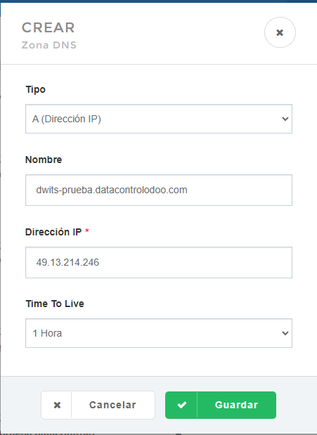

- Nginx: nginx.dwits.datacontrolodoo.com
  
  

- Portainer: portainer.dwits.datacontrolodoo.com
  
  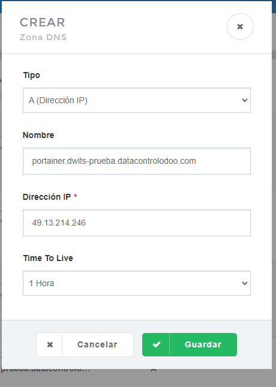

- Webmin: webmin.dwits.datacontrolodoo.com
  
  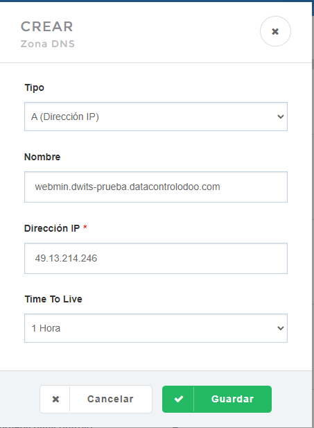

## 7.Instalación NGINX Proxy Manager

Podemos acceder al configurar el Nginx a través del container nginx-app-1 haciendo click a la url del puerto 81.

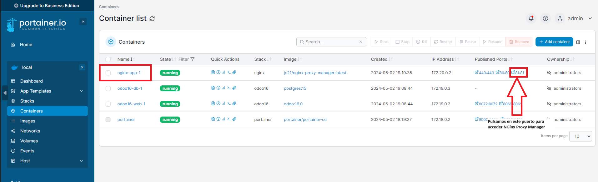

Al acceder a Nginx nos pedirá las credenciales de acceso, le debemos de dar las credenciales que le dimos cuando se incorporó al primer cliente de FE en este servidor.

Seguidamente, accederemos a Hosts/Proxy Hosts que será donde accederemos para crear los certificados SSL de los distintos registros A que hemos creado con el Excel facilitado para esta función.

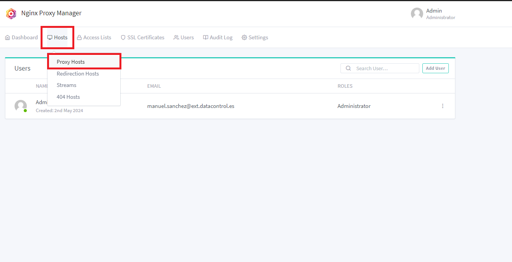

Una vez dentro de esta sección, para añadir los distintos registros A para posteriormente crear sus certificados SSL, debemos de pulsar en el botón "Add Proxy Host".

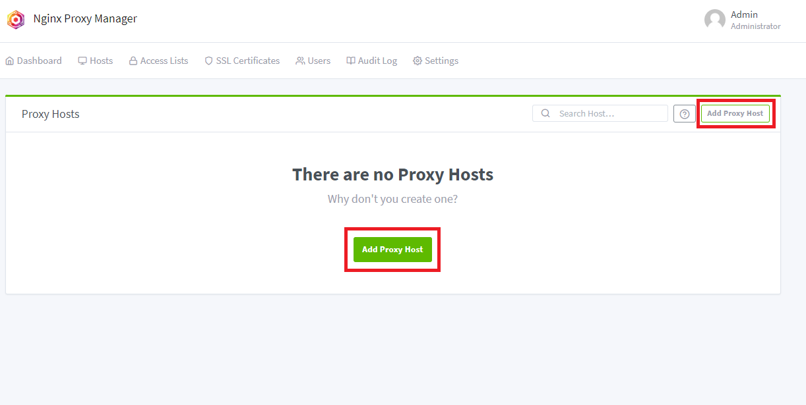

Al pulsar este botón nos aparecerá una ventana emergente donde debemos añadir en "Domain Names" el registro A generado en Excel, en "Forward Hostname / IP" será la IP generada por nuestro servidor Hetzner y el "Forward Port" y, por último, dejamos seleccionado "Block Common Exploits".

A continuación, veremos como se añade cada uno de los registros A que debemos añadir para el Odoo que estamos levantando.

- Registro A de Odoo:

Primero tomamos el registro A de Odoo generado con el Excel:

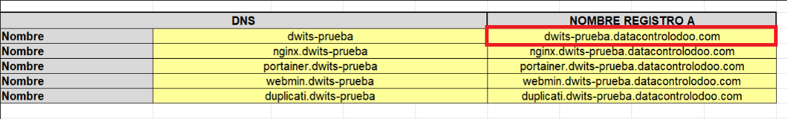

Generamos el Proxy Host de Odoo donde su "Forward Port" es 8069

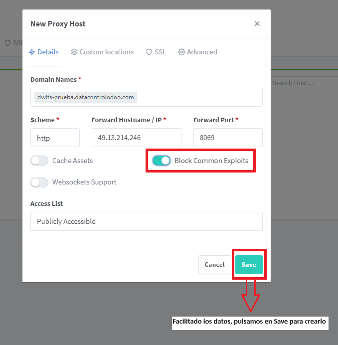

- Registro A de NGinx (Volvemos a pulsar en el botón "Add Proxy Host"):

Primero tomamos el registro A de NGinx generado con el Excel:

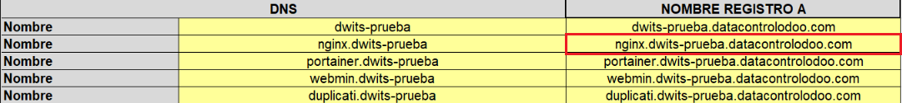

Generamos el Proxy Host de NGinx donde su "Forward Port" es 81.

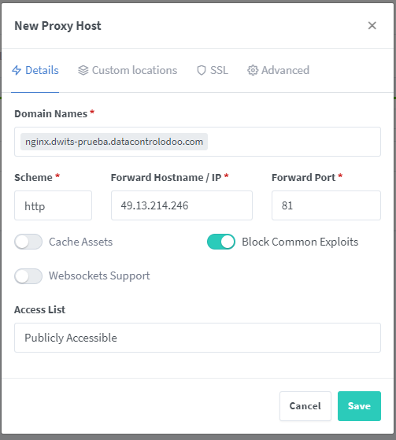

- Registro A de Portainer (Volvemos a pulsar en el botón "Add Proxy Host"):

Primero tomamos el registro A de Portainer generado con el Excel:

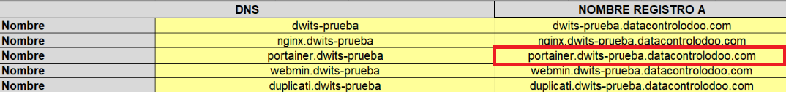

Generamos el Proxy Host de Portainer donde su "Forward Port" es 9000.

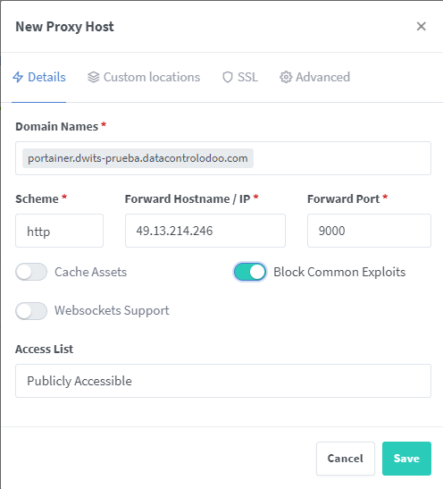

- Registro A de Webmin (Volvemos a pulsar en el botón "Add Proxy Host"):

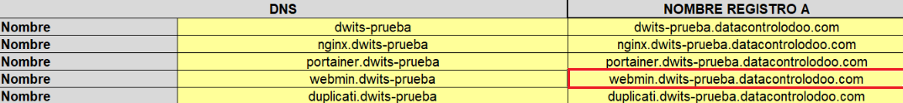

Generamos el Proxy Host de Portainer donde su "Forward Port" es 10000.

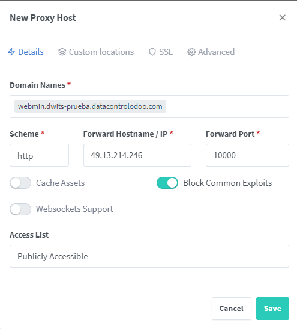

- Registro A de Duplicati (Se añadirán cuando tengamos la guía de las copias de seguridad).

Una vez añadido los registros A tendremos el siguiente panel (Estos registros A que hemos creado, estarán acompañados con los otros registros A creado para los otros clientes de Facturación electrónica que tenga ya el servidor) :

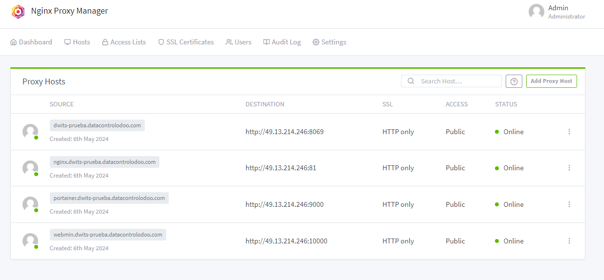

A continuación, crearemos certificado SSL a cada uno de los registros A. Para ello nos situaremos en el registro A que le vamos a crear el certificado SSL y pulsamos en los tres puntitos y le damos a "Edit".

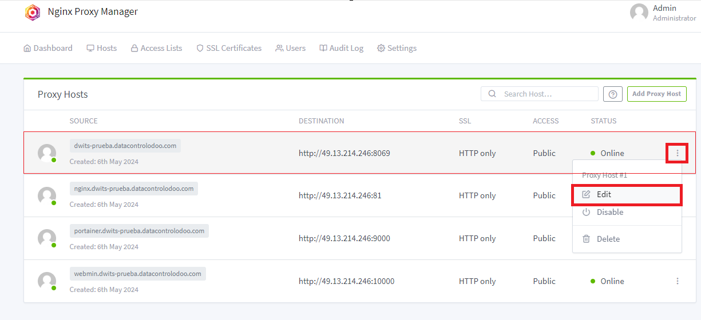

- Cetificado SSL para el registro A de Odoo: En la pantalla emergente que nos aparece, pulsamos en el botón SSL y en el despegable "SSL Certificate" y seleccionamos "Request a new SSL Certificate". Por último, seleccionamos "Force SSL" y "I Agree to the Let's Encrypt Terms of Service". El apartado "Email Address for Let's Encrypt" dejamos el correo que viene por defecto, el cual será el correo que nos ha proporcionado Data Control para esta tarea y será el mismo que le indicamos a NGinx en la activación. Finalizada la configuración guardamos los cambios pulsando en el botón "Save".

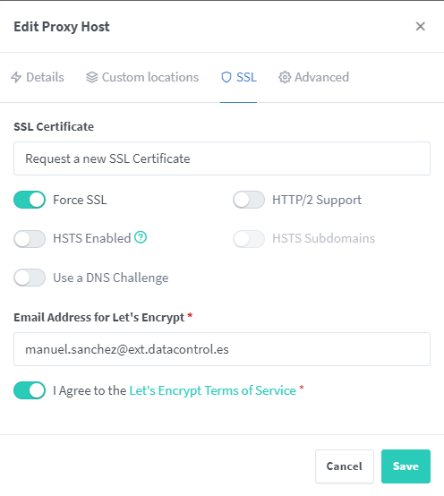

Realizamos la misma operación con el resto de registro A. Una vez se hayan agregado los hosts podremos fijarnos que la columna SSL aparecerá "Let's Encrypt":

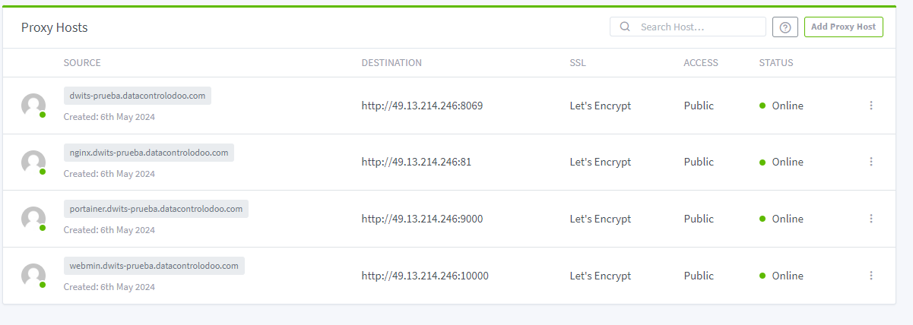

## 8. Creación base de datos de Odoo

Para la creación de la base de datos de Odoo hay que tener en cuenta que la contraseña maestra es siempre 00000000 y el nombre de la base de datos debe ser el nombre del subdominio creado en este caso dwits-prueba

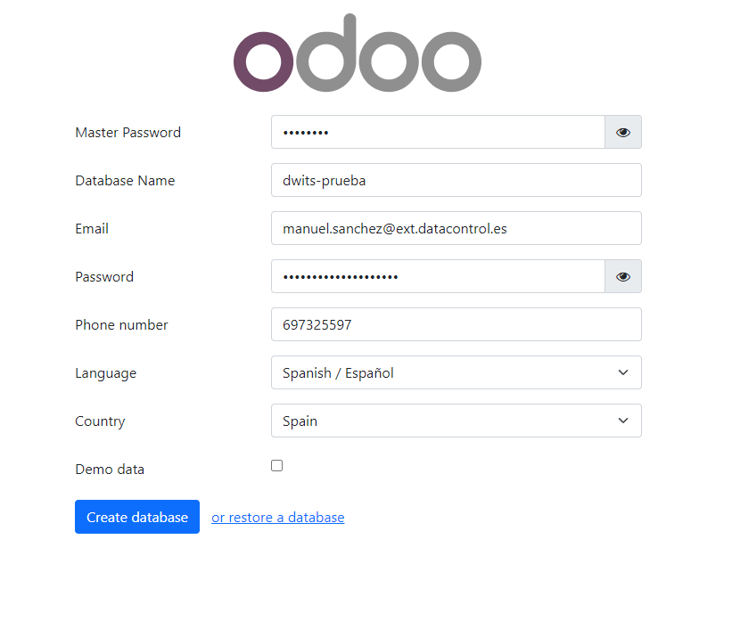
