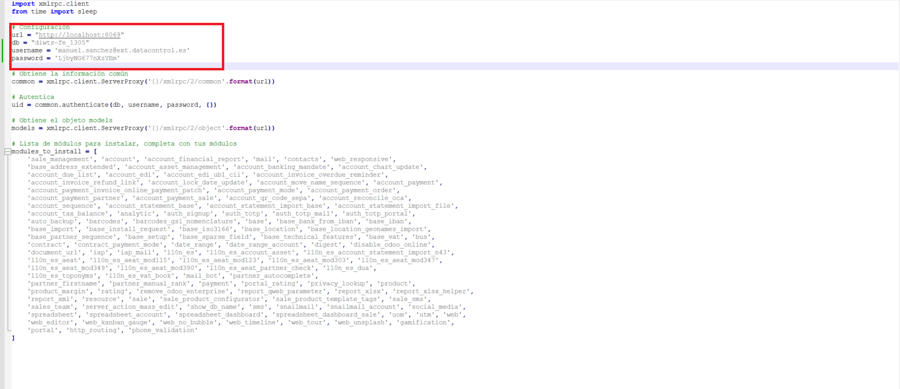

Para añadir nuevos clientes de Facturación electrónica a un servidor que ya contiene otro cliente de facturación electrónica, únicamente deberemos de crear sus DNS y generar sus proxys hosts con certificado SSL con NGINX.

**Para la explicación se ha empleado el mismo ejemplo que el usado para la instalación, pero cada cliente siempre tendrá su propio dominio, que el ejemplo no os confunda.**

## 2. Crear registro A del cliente

Hemos comprado el dominio datacontrolodoo.es, para cada cliente tendremos que crearle varios registros A:

- Servidor

- Portainer

- Webmin

- Nginx

- Duplicatti
1. ¿Cómo elegir el nombre del servidor cliente?
   
   Para elegir el nombre del servidor se tiene que revisar si el cliente tiene dominio propio. Para ello se consultará la ficha de contacto y si el correo electrónico del cliente tiene una extensión de dominio personalizada será ese el nombre del servidor que se usará. Ejemplo, si un cliente tiene de correo electrónico [info.comercial@dwits-prueba.com](mailto:info.comercial@dwits-prueba.com) se deberá de utilizar su nombre de dominio "dwtis-prueba.com" para la creación de su servidor. En cambio, si el cliente no tiene ningún correo electrónico con extensión de dominio personalizada, el programador se deberá de "inventar" el nombre del servidor. Para ello se fijará en el nombre de la empresa y se usará para el nombre del servidor. Ejemplo, si un cliente tiene de correo [info.comercial@gmail.com](mailto:info.comercial@gmail.com) se deberá de "inventar" el nombre del servidor y, para ello, nos fijaremos en el nombre de la empresa que imaginemos que sea Digital Wolf It Solutions, S.L., para este caso un ejemplo de nombre de servidor podría ser DWITS. En cambio, si el nombre de la empresa es Francisco Montes Real pues un nombre de dominio podría ser FMR.
   
   Una vez elegido el nombre del dominio deberemos de acceder al Excel que os facilitaremos para la creación del acrónimo, del nombre del servidor, de las DNS y de los registros A.
   
   Os adjunto un pantallazo usando como ejemplo dwits-prueba:
   
   
   
   La IP de los registros A será la que te ha creado Hetzner, debe ser la misma en cada uno de los registros creados para que apunten al servidor correcto.

2. Cómo Crear los registros A en DONDOMINIO

Accedemos a la siguiente URL: https://manage.panel247.com/login/

Indicamos el nombre del dominio: datacontrolodoo.com, tu usuario y contraseña


Una vez que accedamos al panel principal, nos dirigiremos a la sección "ALOJAMIENTO" y una vez dentro de esta sección pulsaremos en "Zona DNS".


Creamos los registros A que hemos indicado anteriormente. Siguiendo el ejemplo serían los siguientes:

- Servidor: dwits.datacontrolodoo.com
  
  

- Nginx: nginx.dwits.datacontrolodoo.com
  
  

- Portainer: portainer.dwits.datacontrolodoo.com
  
  

- Webmin: webmin.dwits.datacontrolodoo.com
  
  

## 7.Instalación NGINX Proxy Manager

Podemos acceder al configurar el Nginx a través del container nginx-app-1 haciendo click a la url del puerto 81.


Al acceder a Nginx nos pedirá las credenciales de acceso, le debemos de dar las credenciales que le dimos cuando se incorporó al primer cliente de FE en este servidor.

Seguidamente, accederemos a Hosts/Proxy Hosts que será donde accederemos para crear los certificados SSL de los distintos registros A que hemos creado con el Excel facilitado para esta función.


Una vez dentro de esta sección, para añadir los distintos registros A para posteriormente crear sus certificados SSL, debemos de pulsar en el botón "Add Proxy Host".


Al pulsar este botón nos aparecerá una ventana emergente donde debemos añadir en "Domain Names" el registro A generado en Excel, en "Forward Hostname / IP" será la IP generada por nuestro servidor Hetzner y el "Forward Port" y, por último, dejamos seleccionado "Block Common Exploits".

A continuación, veremos como se añade cada uno de los registros A que debemos añadir para el Odoo que estamos levantando.

- Registro A de Odoo:

Primero tomamos el registro A de Odoo generado con el Excel:


Generamos el Proxy Host de Odoo donde su "Forward Port" es 8069


- Registro A de NGinx (Volvemos a pulsar en el botón "Add Proxy Host"):

Primero tomamos el registro A de NGinx generado con el Excel:


Generamos el Proxy Host de NGinx donde su "Forward Port" es 81.


- Registro A de Portainer (Volvemos a pulsar en el botón "Add Proxy Host"):

Primero tomamos el registro A de Portainer generado con el Excel:


Generamos el Proxy Host de Portainer donde su "Forward Port" es 9000.


- Registro A de Webmin (Volvemos a pulsar en el botón "Add Proxy Host"):


Generamos el Proxy Host de Portainer donde su "Forward Port" es 10000.


- Registro A de Duplicati (Se añadirán cuando tengamos la guía de las copias de seguridad).

Una vez añadido los registros A tendremos el siguiente panel (Estos registros A que hemos creado, estarán acompañados con los otros registros A creado para los otros clientes de Facturación electrónica que tenga ya el servidor) :


A continuación, crearemos certificado SSL a cada uno de los registros A. Para ello nos situaremos en el registro A que le vamos a crear el certificado SSL y pulsamos en los tres puntitos y le damos a "Edit".


- Cetificado SSL para el registro A de Odoo: En la pantalla emergente que nos aparece, pulsamos en el botón SSL y en el despegable "SSL Certificate" y seleccionamos "Request a new SSL Certificate". Por último, seleccionamos "Force SSL" y "I Agree to the Let's Encrypt Terms of Service". El apartado "Email Address for Let's Encrypt" dejamos el correo que viene por defecto, el cual será el correo que nos ha proporcionado Data Control para esta tarea y será el mismo que le indicamos a NGinx en la activación. Finalizada la configuración guardamos los cambios pulsando en el botón "Save".


Realizamos la misma operación con el resto de registro A. Una vez se hayan agregado los hosts podremos fijarnos que la columna SSL aparecerá "Let's Encrypt":


## 8. Creación base de datos de Odoo

(Para este ejemplo se ha usado otra instalación de Odoo **dwits-fe-2**)

Antes de crear la base de datos del cliente debemos acceder al archivo odoo.conf mediante Midnight Commander para modificar el filtro list_db donde lo cambiaremos de false a True. De esta manera, podremos ver las base de datos y crearla para el nuevo cliente.

```
mc
```


Para la creación de la base de datos de Odoo apuntaremos las credenciales que usemos para facilitársela posteriormente en el script que se ejecutará para instalar los módulos necesarios según el servicio que requiera el cliente.


- Master Password: será inicialmente la misma para todas las instalaciones Odoo que se realice 00000000

- Database Name: su estructura será siempre el nombre del subdominio creado acompañado de una barra baja y una enumeración indicada. Ejemplo, esta instalacción de odoo el dominio es lobo-digital.datacontrolodoo.com, por lo tanto, el database name podría ser dwits-fe_1305

Una vez creada la base de datos de Odoo, acudiremos al siguiente repositorio git hub [servidor_odoo/Servicios at main · dwits89/servidor_odoo · GitHub](https://github.com/dwits89/servidor_odoo/tree/main/Servicios) y descargaremos el script del servicio que se le esté ofreciendo al cliente, que siguiendo este guía será siempre facturación electrónica:


Ejemplo, en el caso que se vaya instalar a un cliente un odoo con facturación electrónica Odoo-FE. Accedemos a está carpeta y descargamos el script que contiene.


Para descargar el script, pulsamos en install_modules.py y una vez abierto el archivo, lo descargamos.


Una vez descargado el fichero, lo editamos para facilitarle la configuración de nuestro Odoo.



Una vez editado el fichero, con la configuración del Odoo que estamos instalando, nos debemos conectar por sftp al servidor.

- Nos desconectamos del servidor pulsando en el botón "Log Out" (En caso que estuvieramos aún conectado de un paso anterior)


- Nos volvemos a conectar al servidor pulsando en el botón "Log in".


Y nos conectamos por SFTP a nuestro servidor pulsando en "New SFTP window":


Al pulsar en este botón, se nos abrirá una nueva ventana con el SFTP, donde en el panel de la izquierda se encontrará nuestro ordenador y en la derecha el servidor. En el panel de la iziquierda daremos el directorio donde tengamos nuestro archivo script descargado y editado con la configuración, y en la pantalla de la derecha accederemos al directorio /opt


En el panel de la derecha, creamos una carpeta que llamaremos scripts y será donde subamos nuestro archivo script. Muy importante, el archivo script que subamos siempre tendrá que tener el nombre install_modules.py


Archivo subido en el directorio /opt/scripts:


Una vez subido el fichero, es momento de ejecutar el script en nuestra consola. Para ello abrimos una consola:


Seguidamente, nos situamos en el directorio que encuentra el script:

```
cd /opt/scripts
```

Otorgamos permisos de ejecución al fichero que contiene el script:

```
sudo chmod +x install_modules.py
```


Y ejecutamos el script:

```
python3 /opt/scripts/install_modules.py
```


Si todo ha ido correctamente aparecerá el siguiente mensaje.

Sí alguno de los módulo no ha podido instalarse, se te indicará cual ha sido dando el nombre técnico. Dado ese caso, se tendrá que instalar manualmente.

Para dar por finalizada la instalación de Odoo, se debe instalar manualmente los tres siguientes módulo:

- l10n_es_partner

- l10n_es_facturae

- login_user_detail

El módulo l10n_es_partner pedirá dónde tomar los datos, donde se indicará que lo importe desde internet:


Instalado los módulos restante a mano, accedemos a nuestra consola y entramos en Midnight Commander para volver a editar el archivo odoo.conf y cambiar el filtro list_db de True a false.

```
mc
```


